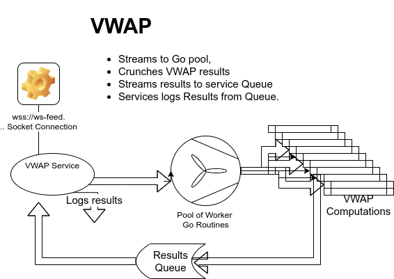

# Getting started
```sh
# connects to ws-feed.exchange.coinbase.com, 
# 5 go routines, 200 data points window
# see build/vwap -h for configuration details
make run-prod
# or 
make && build/vwap 
```
```sh
λ build/vwap
{"level":"info","ts":1637053728.8822916,"logger":"wss://ws-feed.exchange.coinbase.com","caller":"trades-vwap/main.go:49","msg":"Starting..."}
{"level":"info","ts":1637053728.882322,"logger":"wss://ws-feed.exchange.coinbase.com","caller":"trades-vwap/main.go:50","msg":"Subscribing","Pairs":["BTC-USD","ETH-USD","ETH-BTC"]}
{"level":"info","ts":1637053728.88233,"logger":"wss://ws-feed.exchange.coinbase.com","caller":"trades-vwap/main.go:51","msg":"log-mode","development":false}
{"level":"info","ts":1637053728.8823357,"logger":"wss://ws-feed.exchange.coinbase.com","caller":"trades-vwap/main.go:52","msg":"Socket","URL":"wss://ws-feed.exchange.coinbase.com"}
{"level":"error","ts":1637053729.6383498,"logger":"wss://ws-feed.exchange.coinbase.com","caller":"s hereerver/socket.go:55","msg":"Sending a subscribe msg erred","stacktrace":"github.com/blewater/zh/server.Subscribe\n\t/home/mar/go/src/github.com/blewater/trades-vwap/server/socket.go:55\ngithub.com/blewater/zh/workflow.(*Client).TradesToVwap\n\t/home/mar/go/src/github.com/blewater/trades-vwap/workflow/stream.go:59\nmain.main.func1\n\t/home/mar/go/src/github.com/blewater/trades-vwap/main.go:27"}
{"level":"info","ts":1637053729.780856,"logger":"wss://ws-feed.exchange.coinbase.com","caller":"workflow/stream.go:104","msg":"Subscribed:"}
ProductID:ETH-BTC VWAP:0.070830
ProductID:BTC-USD VWAP:60749.990000
ProductID:ETH-USD VWAP:4302.990000
ProductID:ETH-USD VWAP:4302.455930
ProductID:BTC-USD VWAP:60742.845389
ProductID:ETH-USD VWAP:4302.451630
...
```
### Optimization Update
As identified by benchmarking the top bottleneck, three efficient field parsers utilizing `bytes.indexOf()` (*without malloc and internally implemented with assembly instructions by the std library*) replaced the JSON unmarshalling gorilla call thus lowering memory and I/O system demands. The efficiency gain is reflected in the updated benchmarking profiling below.

# Trades -> vwap
#### A VWAP (volume-weighted average price) calculator for streaming Coinbase trades

#### A single consumer with multiple VWAP producers design. 
A thread listens to the Coinbase socket connection and fans-out trade ~~unmarshalled Json~~ byte parsed trade messages to the workers' routines pool.  This service employs Go's memory pool too. See the next section.
Goroutines receive a queued trade quote in async fashion to generate a VWAP result for the `same product`.
It does so by consulting the cached matching Product queue of VWAP results, so the newly generated *product VWAP* value reflects being chronologically last at the top of the previous 200 (default, the window size is configurable) VWAP data points generated before it.



#### About memory pooling
Any long-running streaming service unavoidably puts enormous memory pressure on memory-managed languages, i.e., Go. The constant creation and disposal of temporary objects quickly fill up the available memory heap resulting in intermittent activation of the garbage collection language runtime. While Go strives not to impact performance *severely*, there is still a penalty, and an ill-designed service may render its runtime container unstable, i.e., *LXC*. To address that constant HEAP pressure, Go offers a [memory pool](https://pkg.go.dev/sync#Pool) for recycling temp objects and is employed for `big.float` and other trade structs in this service. While it appeared that float64 offers sufficient precision for the incoming trade values, it seemed more appropriate to employ `big.float` types. A testing algorithm using float64 data types is included for documentation purposes.

#### Why big.float?
A testing `float64` algorithm is included for documentation purposes. Sampling the input trade quotes 8 decimal digits, it appears float64 offers sufficient precision for the incoming trade values. But, it seemed more appropriate to employ `big.float` types for the increased precision in the resulting division operations.

#### Go routines
While Go offers lightweight threads in the fashion of Erlang, they still occur overhead, e.g., 4k stack each thus, a throttling design should be employed. A known straightforward, efficient pattern is thread pools. Launching to a specific limit at the service launch, they scale with sufficient processing bandwidth to a much higher number of incoming requests. 

If the host allowed multiple connections from the same client IP, it would enable input processing parallelism. Since this is not the case here, it is still feasible to achieve a degree of parallelism later in the pipeline (as the included benchmark test shows) by queueing the ingested trade messages for the thread pool to process.

#### Go's sync.Map
The Go's pkg dev [documentation](https://pkg.go.dev/sync#Map) lists the `sync.Map` as suitable for the disproportionate number of reads vs. writes which is the case here.

#### Benchmarking
In the `makefile`, there is a target to benchmark 100 transactions (listening, processing, and ingesting the VWAP results queue)  in several pool sizes, i.e., 1, 2, 3, 5, 10, 100, 200. The benchmarks can only highlight trends since the transactions are asynchronous and influenced by the day traffic. 

#### In Ubuntu 20.04 
`make bench`
**A run after replacing JSON unmarshalling with byte parsing functions**
```shell
Benchmark_100_VWAP_Trx_1Thread-16                      1        10191818424 ns/op        3951112 B/op      42407 allocs/op
Benchmark_100_VWAP_Trx_2Threads-16                     1        16115273285 ns/op         272104 B/op       3902 allocs/op
Benchmark_100_VWAP_Trx_3Threads-16                     1        13917217261 ns/op         270800 B/op       3915 allocs/op
Benchmark_100_VWAP_Trx_5Threads-16                     1        11186958717 ns/op         270168 B/op       3844 allocs/op
Benchmark_100_VWAP_Trx_10Threads-16                    1        17169675659 ns/op         276272 B/op       3948 allocs/op
Benchmark_100_VWAP_Trx_100Threads-16                   1        13048275212 ns/op         345688 B/op       4273 allocs/op
Benchmark_100_VWAP_Trx_200Threads-16                   1        14986465890 ns/op         410744 B/op       4724 allocs/op
```
**A run employing memory pool**
``` shell
Benchmark_100_VWAP_Trx_1Thread-16                      1        18692163055 ns/op        3954464 B/op      43279 allocs/op
Benchmark_100_VWAP_Trx_2Threads-16                     1        20447973426 ns/op         306000 B/op       4890 allocs/op
Benchmark_100_VWAP_Trx_3Threads-16                     1        14296614771 ns/op         314472 B/op       5058 allocs/op
Benchmark_100_VWAP_Trx_5Threads-16                     1        23358468964 ns/op         310888 B/op       4971 allocs/op
Benchmark_100_VWAP_Trx_10Threads-16                    1        17694583925 ns/op         318744 B/op       5129 allocs/op
Benchmark_100_VWAP_Trx_100Threads-16                   1        13594751784 ns/op         411320 B/op       6004 allocs/op
Benchmark_100_VWAP_Trx_200Threads-16                   1        14380694155 ns/op         482472 B/op       6487 allocs/op```

```
**A run without a memory pool**
```
Benchmark_100_VWAP_Trx_1Thread-16                      1        16615332934 ns/op
Benchmark_100_VWAP_Trx_2Threads-16                     1        26071586811 ns/op
Benchmark_100_VWAP_Trx_3Threads-16                     1        29935633754 ns/op
Benchmark_100_VWAP_Trx_5Threads-16                     1        23910722054 ns/op
Benchmark_100_VWAP_Trx_10Threads-16                    1        27848430412 ns/op
Benchmark_100_VWAP_Trx_100Threads-16                   1        22826719074 ns/op
Benchmark_100_VWAP_Trx_200Threads-16                   1        22012305333 ns/op
```
Benchmarking also generates profiling information.

#### After the replacing of JSON marshalers with bytes parsers  

```sh
λ go tool pprof workflow.test profile_cpu.out
```
#### After the removal of JSON marshalling
```sh
File: workflow.test
Type: cpu
Duration: 96.62s, Total samples = 130ms ( 0.13%)
Entering interactive mode (type "help" for commands, "o" for options)
(pprof) top10
Showing nodes accounting for 130ms, 100% of 130ms total
Showing top 10 nodes out of 116
      flat  flat%   sum%        cum   cum%
      40ms 30.77% 30.77%       40ms 30.77%  runtime.futex
      10ms  7.69% 38.46%       10ms  7.69%  bytes.IndexAny
      10ms  7.69% 46.15%       10ms  7.69%  p256MulInternal
      10ms  7.69% 53.85%       10ms  7.69%  runtime.(*itabTableType).find
      10ms  7.69% 61.54%       10ms  7.69%  runtime.(*lfstack).empty (inline)
      10ms  7.69% 69.23%       10ms  7.69%  runtime.bgscavenge
      10ms  7.69% 76.92%       20ms 15.38%  runtime.mallocgc
      10ms  7.69% 84.62%       10ms  7.69%  runtime.pcvalue
      10ms  7.69% 92.31%       10ms  7.69%  runtime.scanblock
      10ms  7.69%   100%       30ms 23.08%  runtime.schedule
```
#### Before with JSON marshalling
```sh
File: workflow.test
Type: cpu
Time: Nov 15, 2021 at 2:25pm (EET)
Duration: 173.26s, Total samples = 60ms (0.035%)
Entering interactive mode (type "help" for commands, "o" for options)
(pprof) top10
Showing nodes accounting for 60ms, 100% of 60ms total
Showing top 10 nodes out of 40
      flat  flat%   sum%        cum   cum%
      10ms 16.67% 16.67%       20ms 33.33%  internal/poll.(*FD).Read
      10ms 16.67% 33.33%       10ms 16.67%  runtime.(*randomEnum).next
      10ms 16.67% 50.00%       10ms 16.67%  runtime.bgscavenge.func1
      10ms 16.67% 66.67%       10ms 16.67%  runtime.epollwait
      10ms 16.67% 83.33%       10ms 16.67%  runtime.madvise
      10ms 16.67%   100%       10ms 16.67%  syscall.Syscall
         0     0%   100%       20ms 33.33%  bufio.(*Reader).Peek
         0     0%   100%       20ms 33.33%  bufio.(*Reader).fill
         0     0%   100%       20ms 33.33%  bytes.(*Buffer).ReadFrom
         0     0%   100%       20ms 33.33%  crypto/tls.(*Conn).Read
```
#### The generated profile_cpu.svg


#### Logging, instrumentation and observations.
While this service only includes logging, I selected Uber's zap logger for its environment configuration awareness and efficient logging without employing reflection.